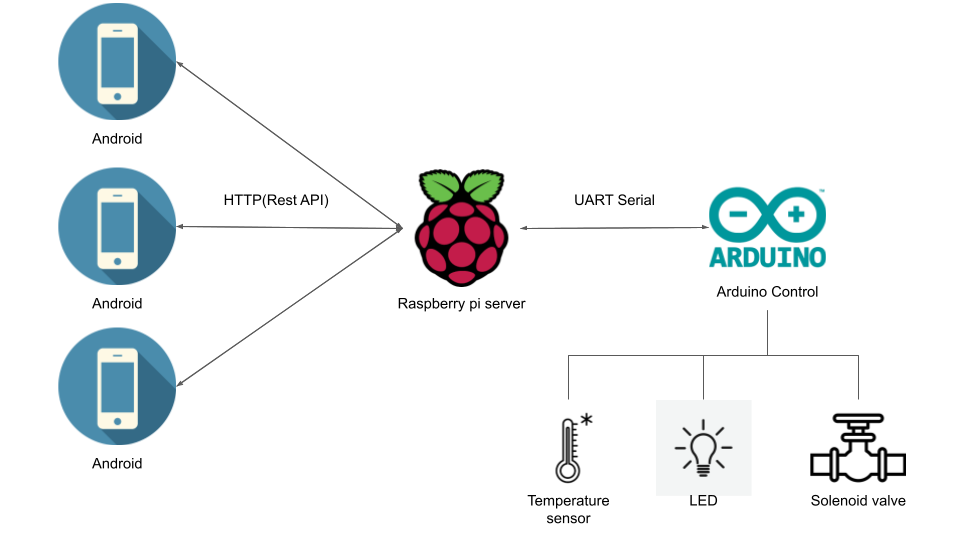
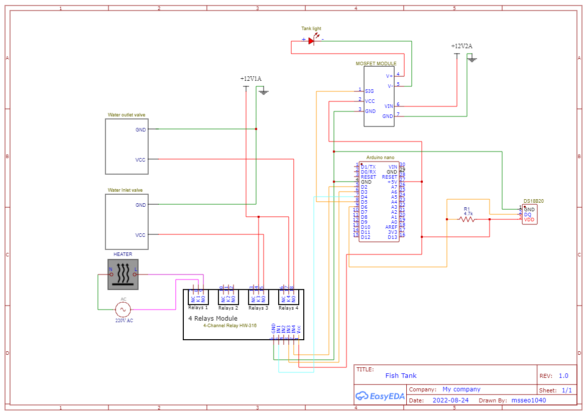

# Fish tank 제어 프로젝트
어항의 환수, 조명, 수온 등을 센서, 아두이노, 라즈베리파이 를 이용하여 안드로이드 앱으로 제어하는 프로젝트 입니다.

## 주요 기능
- Solanoid valve open/close 제어로 환수 자동화.
- 조명 밝기 0~100% 제어
- 수온 모니터링
- 히터를 수온센서와 연동하여 정확하게 수온유지

## Diagram
* 전체 Flow

* Arduino module

